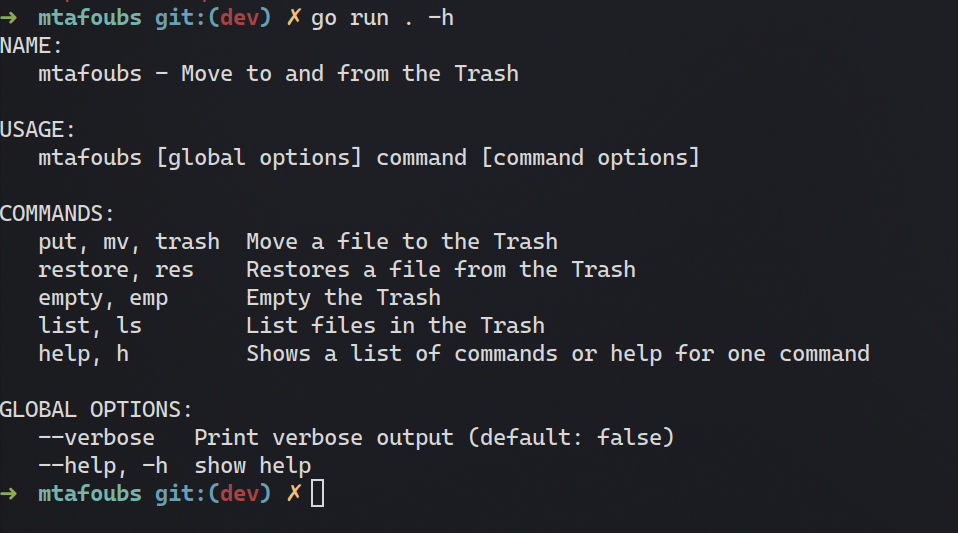

# mtafoubs


`mtafoubs` is a simple Go CLI tool to move trash across Linux systems. It is inspired by `trash-cli`. Though, what makes it different is: it allows moving trash across fileystems; i.e: you can make your Trash directory a symlink to store it on a NAS! This saves space and allows you to keep trash for longer.

# Usage
To use, simply run the compiled executable.

There are prebuilt executables provided on the Releases page.

However, if you compile it manually, it would still work.

# Compiling
To compile, Go will take care of everything for you.

Just run:

```sh
go build .
```